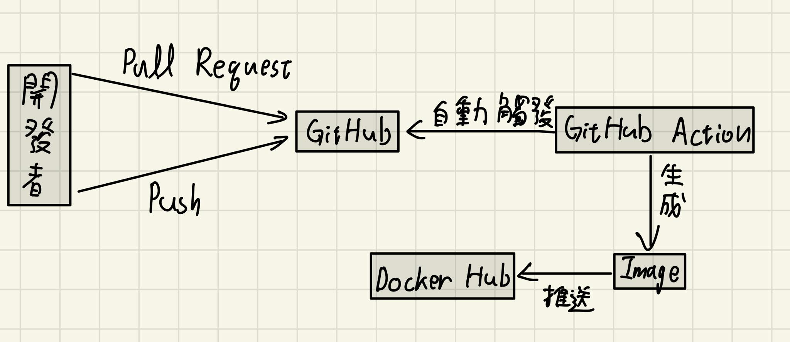

# Docker-test
try some ability of GitHub Action about docker

# How to Build Image and Run a Container with It.

1. Build an image named env-image
```
docker build -f Dockerfile -t env-image .
```

2. Run a container according to above image
```
docker run -p 5000:5000 --name sus_app env-image
``` 

3. Now you can go to 127.0.0.1:5000 to check this app

# 專案自動產生Container Image的邏輯Tag的選擇邏輯
每當main上發生push或是其他branch使用pull reqeust時，專案就會用action來build一個Container Image，並以sus_app_image加上action執行的時間作為tag，接著把此Container Image推送到Docker Hub，我們就可以在Docker Hub上簡易的辨識哪個Image是新版本。


